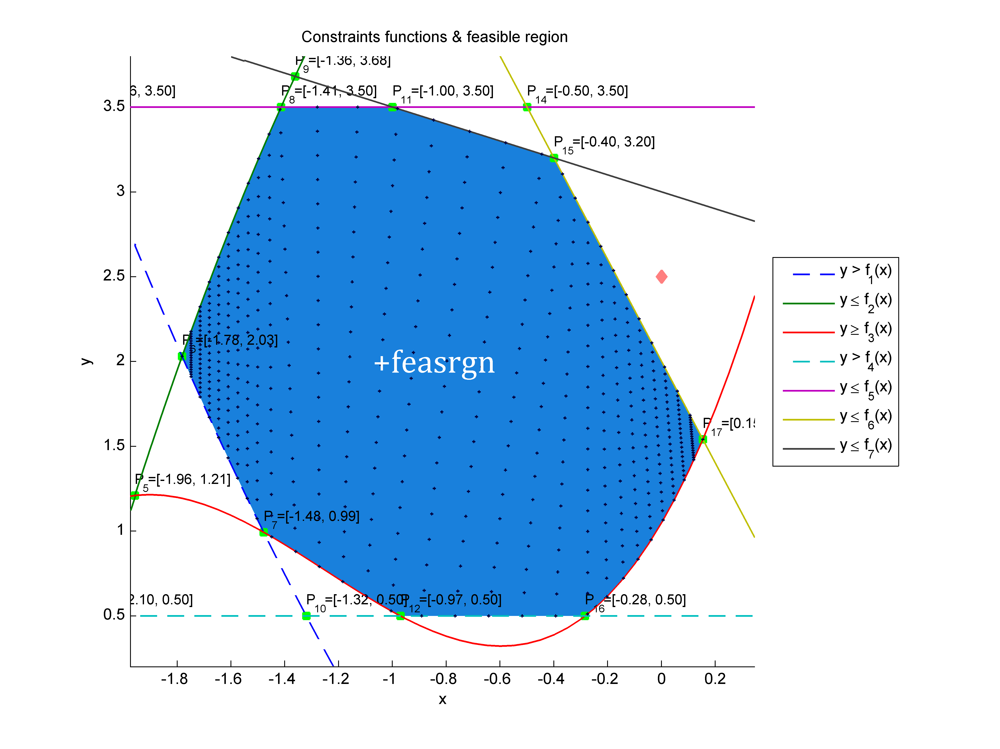

# feasrgn
Piecewise linear feasible region



Finds the piecewise linear feasible region from a set of constraints functions (inequalities) derived within the actual problem domain.

```
  y 'sign' f1(x)
  y 'sign' f2(x)
  :
  y 'sign' fn(x)
```

where `sign` can be any inequality sign `<`, `<=`, `>` or `>=` and `f(x)` is the constraint function which is either constant, linear or possibly nonlinear.

## Description
The algorithm makes no assumptions on the specified constraints functions which can be either constant, linear or possibly nonlinear. The constraint functions are initially represented by anonymous functions which will be 
converted into piecewise linear functions within the specified interval `xmin <= x <= xmax` for the independent variable. The resolution of the discrete grid is controlled by `dx`.

It works out the feasible region by first sorting the sampled functions followed by detection of their intersections which will be injected into the discrete x-grid so that they can be included in the final feasible 
region boundary. The final feasible region is then found by scanning along the discrete x-grid for valid (non-conflicting) constraints.

The output is ultimately a closed piecewise linear boundary B representing the feasible region to be used in solving 2-dimensional optimization problems.

Possibly multiple feasible regions is not handled which could yield unexpected results.

## Packages
+feasrgn

# MATLAB FileExchange
This work has been published to [MATLAB File Exchange][matlab-file-exchange]

[matlab-file-exchange]: https://se.mathworks.com/matlabcentral/fileexchange/60049-jarirepo-feasrgn?s_tid=FX_rc1_behav
